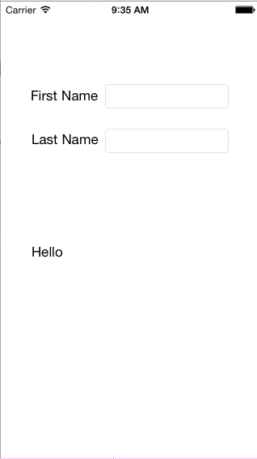

keyvalueobserving-tutorial
==========================

Key-Value Observing (KVO) is one technique that the Cocoa framework provides for observing specific property changes for an object.  Not only can you observe simple attribute changes with KVO but you can observe changes for "to one" and "to many" relationships.  Implementing KVO involves the following steps.

In this application we will create Person data model which holds two properties (firstName and lastName) and a "to-one" property relationship.  The "to-one" relationship will be a method named "fullName" which returns a string with the firstName and lastName properties.  The application will be a single view application and contain two textfield controls and a label which will be populated on KVO changes to the fullName "to-one" relationship.

